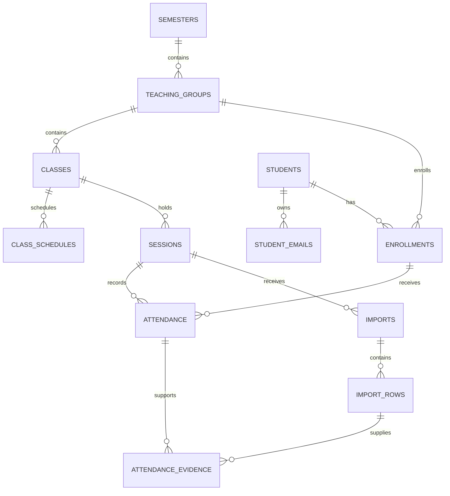

# Proposed database design

The original logical design is approved. The new baseline `supabase/001_schema.sql` implements its core relationships and the latest extra-session/lifecycle rules. It is locally tested, not applied to hosted Supabase. See [setup guidance](04-setup-and-optimization.md) for scope and remaining workflow RPCs.

## Relationships

## Tables

All entity IDs are internal UUIDs. Mutable entities include created_at, updated_at, and a revision number where concurrent changes matter.

| Table | Key columns and purpose |
|---|---|
| admin_accounts | auth_user_id primary key, allowed_email, active. Provision manually; no browser-based membership changes. |
| students | id, full_name, phone nullable, notes nullable, archived_at nullable. |
| student_emails | id, student_id, email_original, email_normalized, kind primary/additional, approved_at, approved_by. All active emails share one uniqueness constraint. |
| semesters | id, name, start_date, end_date, timezone, state planned/active/completed/archived. |
| teaching_groups | id, semester_id, name, notes, archived_at. A copied group gets a new ID. |
| classes | id, group_id, name, notes, state active/completed/archived. |
| class_schedules | id, class_id, weekday, local_start_time, local_end_time, effective_from, effective_to. Schedule changes affect only intentionally regenerated future sessions. |
| sessions | id, class_id, starts_at, ends_at, topic, occurrence_state, attendance_state, session_type (regular/makeup/extra), generated counts_toward_attendance (false for extra), cancellation_reason, finalized_at, revision. |
| enrollments | id, student_id, semester_id, group_id, joined_on, lifecycle_status (active/withdrawn/transferred), lifecycle_reason, lifecycle_changed_at, revision, notes. Transfer retains the original group. Both actions can be reversed. |
| attendance | id, session_id, enrollment_id, status nullable, status_source, remark nullable, revision, last_changed_by. Null status represents unmarked. |
| imports | id, session_id, storage_path, original_filename, file_sha256, byte_size, file_type, state, worksheet, column_mapping JSON, uploaded_at, finalized_at, undone_at. |
| import_rows | id, import_id, row_number, raw_values JSON, attendee_name, email_original, email_normalized nullable, resolved_student_id nullable, resolution_state, resolution_method, ignore_reason nullable, pending_email_action JSON nullable. |
| attendance_evidence | id, attendance_id, import_row_id nullable, evidence_type import/manual/pre_enrollment_credit, active, created_at, revoked_at. Preserve multiple contributing rows/imports. |
| audit_events | id, actor_id, action, entity_type, entity_id, before_values JSON, after_values JSON, reason nullable, transaction_id, created_at. Append-only to normal app operations. |

Keep original emails for display and a canonical trimmed, lowercased form for lookup. Use one email table for primary and additional addresses so uniqueness cannot be bypassed across separate tables. Primary email is shown in student forms through this relationship.

## Constraints and invariants

- Unique student_emails.email_normalized across every student and email kind.
- At most one primary email per student; student creation and primary-email changes must ensure exactly one at transaction completion.
- Unique enrollments(student_id, semester_id).
- Enforce enrollment.semester_id equals the selected group's semester, with a composite foreign key or equivalent constraint.
- Unique attendance(session_id, enrollment_id).
- Enforce that the enrollment group equals the session class's group. Use a database constraint trigger or transaction routine, not only browser validation.
- Unique import_rows(import_id, row_number). Imported row references must belong to the same session as the linked attendance.
- Require sensible date/time ranges; reject finalization of future or cancelled sessions.
- File hashes identify repeat files but are not globally unique: a file may contain data requiring explicit use in another session. Keep intentional reprocessing attempts traceable.
- Extra sessions outside semester boundaries require an explicit, documented extension decision rather than silently changing eligibility.
- Email removal preserves its prior value in audit/import history. It does not change old resolved student IDs.

## Transaction boundaries

Use protected server-side/database operations for actions spanning several tables:

1. Create student with primary email, or replace a primary email.
2. Enroll student, check one-group rule, and preview/apply earlier-session credits.
3. Finalize import: lock/version-check the session; revalidate identities, enrollment and pending email actions; apply evidence; merge statuses; fill eligible absences; append audit entries; finalize atomically.
4. Correct attendance and remark together, preserving the original values in history.
5. Reassign an additional email with explicit administrator resolution and current-owner verification.
6. Undo import: deactivate that import's evidence, recompute affected imported outcomes, retain later manual decisions and other evidence, and show ambiguous changes for review.
7. Set or reverse enrollment lifecycle: require a reason and expected revision, preserve group and attendance, log old/new state, and derive updated failure results.

Undoing attendance does not automatically reverse saved email associations. Those may have been used by later imports; offer a separate explicit correction with history.

Draft operations must not mutate official attendance, approved emails, or final statistics. A failed finalization must leave no partial changes. Upload persistence and the database are separate operations: represent failed uploads/processing explicitly and support safe retry.

## Calculation model

Derive totals from eligible attendance rather than keeping editable counters:

- Scope is student + class + semester.
- Include only held, finalized sessions that count toward attendance.
- Present includes pre-enrollment credit.
- Denominator is Present + Absent + Leave.
- Attendance threshold uses exact counts (for 75%, 4 x Present >= 3 x denominator) rather than rounded display values.
- Leave > 3 means failed under the leave rule. Extra sessions are excluded from both percentages and this count.
- Withdrawn/transferred enrollment overrides every class result to failed with the explicit lifecycle reason. Restoring active status recalculates normal results from unchanged attendance.
- Otherwise, a completed class with a nonzero denominator meets requirements only if attendance is at least 75%.
- In-progress low attendance means at risk. No denominator means insufficient data.
- Recalculate when attendance, session eligibility, or enrollment is explicitly corrected.

## Access and storage design

- Bind authorization to the manually approved Auth user ID, with the configured email consistent with that account.
- Apply owner checks to all application tables and private file access. Authenticated does not by itself mean authorized.
- The app user cannot add allowed administrators or modify audit events directly.
- Never include administrative/service secrets in Vite's browser bundle. Use browser-safe project configuration only where intended, protected by database/storage policies.
- Retain originals in a private bucket under generated paths; preserve the user's original filename as metadata rather than trusting it as a path.
- Downloads must require current authorization. Uploaded spreadsheet cells are data, not instructions; exports must neutralize spreadsheet formula injection in user-supplied text.
- Define configurable file-size/row limits during implementation and validate actual file content as well as extension.
- Retention is indefinite by default per the request to keep original reports; storage usage should be visible during operations. Backup/recovery configuration is a deployment decision, not a claimed existing feature.
